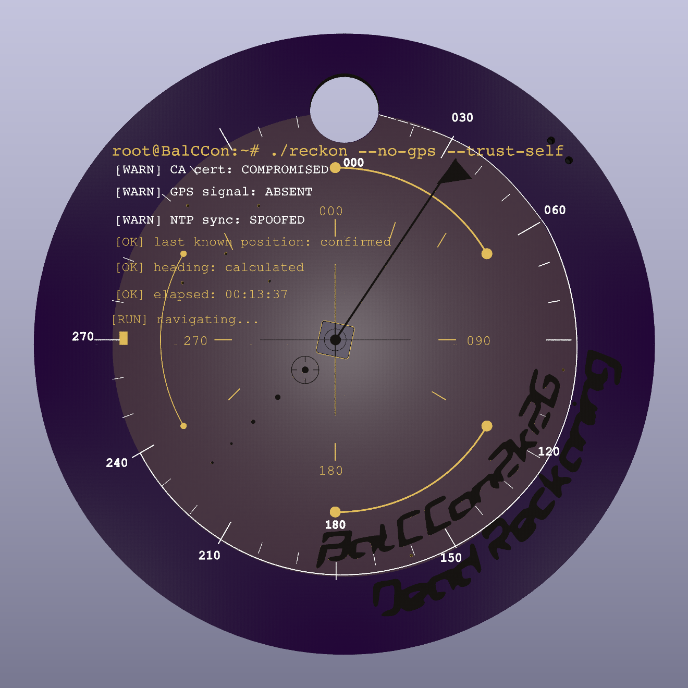
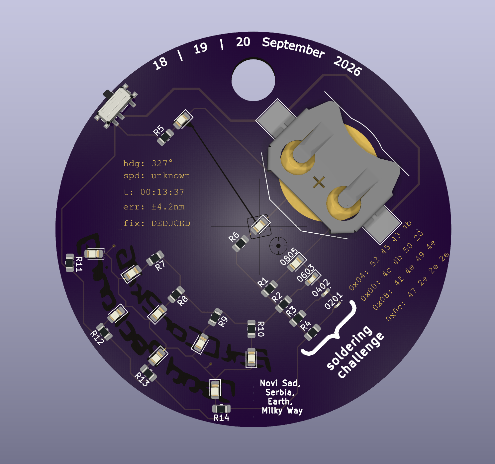
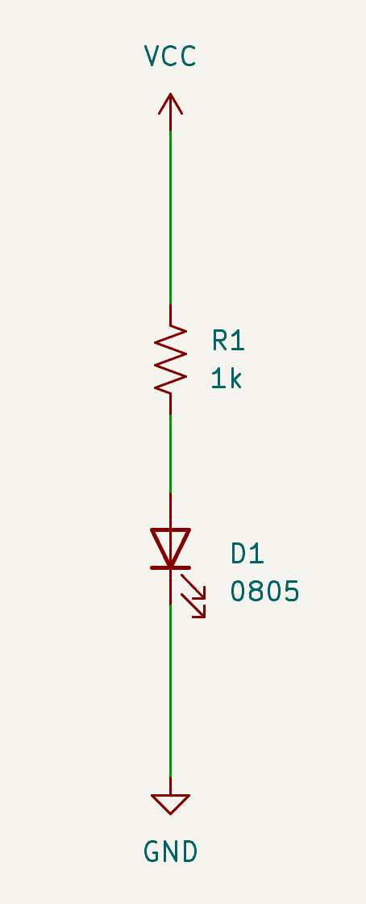
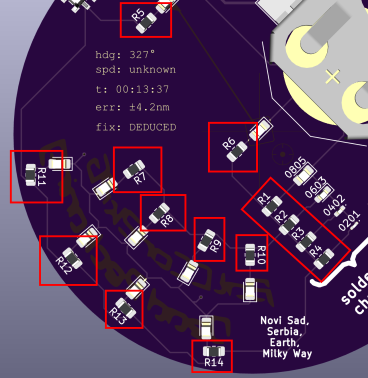
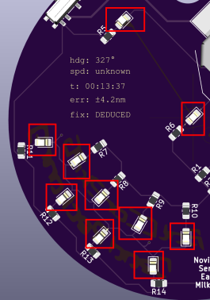
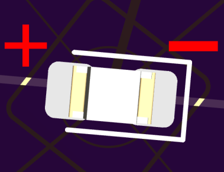
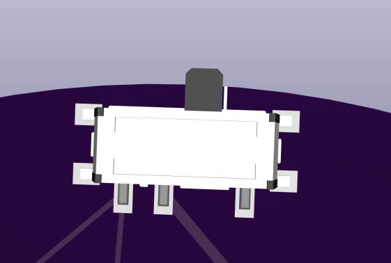
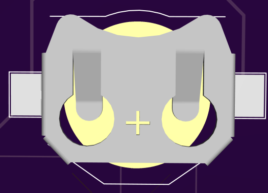

# balccon-2k26-badge

Design assets for the BalCCon 2k26 PCB-style pin/badge.

### The board

The front carries the silkscreen artwork only — no components. Everything
gets soldered to the back.

| Front | Back  |
| --- | --- |
|  |  |

### Electronics components

| Qty | Ref | Part | Package / Value |
| --- | --- | --- | --- |
| 1 | BT1 | Coin cell holder | CR2032 |
| 11 | D1,D5-D14 | LED | 0805| 
| 1 | D2| LED | 0603| 
| 1 | D3| LED | 0402| 
| 1 | D4| LED | 0201| 
| 14 | R1–R14 | 1kΩ | 0805 |
| 1 | SW1 | Slide switch, SPDT | PCM12 |

### Schematic

Each of the 14 LEDs is wired the same way: **VCC → resistor → LED → GND**,
one branch per LED, all 14 branches in parallel. Circuit explanation:

- **Voltage** is the electrical "push" between two points — here, the ~3V
  the CR2032 battery provides between VCC and GND. **Current** is the actual
  flow of electrons through the circuit, driven by that voltage.
- An LED only conducts one way, and left unchecked it will pull more current
  than it can handle and burn out. The resistor limits the current to a safe
  level (1kΩ per branch) so the LED just lights up instead.
- Each LED has its own resistor, so the 14 branches are independent — one
  LED (or a joint that isn't soldered yet) doesn't affect the others.

BT1 (the coin cell) is what supplies VCC to all of this, and SW1 sits
between the battery and the rest of the board — flipping it is what turns
the whole badge on and off.

## Assembly Instructions

General rule: solder the smallest / lowest-profile components first, so
taller parts don't block your iron from reaching the rest.

Since the LEDs are independent, you don't need to solder all of them to have something shining.

### Step 1 — Resistors (components marked with R#, ex. R8)

- Resistors have no polarity — they work the same no matter which way
  around you place them, so don't worry about orientation.
- Put solder on one pad first, place the resistor on it and solder that
  side, then solder the other side.

### Step 2 — LEDs

Solder every LED highlighted above (skip the small 0603/0402/0201 chain —
that's the solder challenge, saved for the end).

- Unlike resistors, LEDs are polarized — they only light up one way around.
  The negative side needs to go towards the white mark on the footprint:

  

- Same technique as the resistors: solder one pad first, place the LED on
  it and solder that side, then solder the other side.
- The trick: solder the LED upside down (flipped, facing into the board)
  and the light shines *through* the PCB — that's what the badge is
  designed for, and how the cool kids do it. Soldering it right-side up
  works too, it just points the light outward instead.

### Step 3 — Switch (SW1)

- Same technique as before: put solder on one pad, place the switch in
  position and solder that pad to tack it down, then solder the rest of
  the pads.

### Step 4 — Battery holder (BT1)

- Same technique: put solder on one pad, place the holder and solder that
  pad, then solder the rest of the pads.
- It's the tallest part on the board, so solder it last — once it's on,
  taller components won't get in the way of anything else.

### Step 5 — Power on

TODO — insert the CR2032 battery, flip the switch, and verify all 14 LEDs
light up.

### Step 6 — Solder challenge (optional)

TODO — solder the 0603, then 0402, then 0201 LED last, in shrinking order.

## Repository Layout

- `photos/` — renders/photos of the board and badge, used in the assembly instructions above
- `svg/` — vector source files (Inkscape)
  - `pcb-only.svg` — final PCB-only artwork
  - `logo2k26_08.08-original.svg` — original full logo artwork
  - `pcb-assets.svg`, `pcb-decomposed.svg` — decomposed/layered PCB artwork elements
- `png/colors/` — rendered color variants (black, blue, green, purple, red, white, yellow)
- `png/swatches/` — small reference color swatches (FR4 board color, grey)
- `balccon-2k26-hardware/` — KiCad project for the physical pin/badge PCB (schematic, board, routed and with silkscreen finished)
  - `pcb-svg/` — SVG layers exported from KiCad (`copper.svg`, `mask-front.svg`, `mask-back.svg`, `silkscreen-front.svg`, `edge-cuts.svg`, `hex.svg`, `log.svg`, `date.svg`)
  - `fabrication/` — Gerber and drill files exported for board fabrication (gitignored; regenerate via KiCad's Plot dialog)
  - `orders/` — `fabrication-YYYY-MM-DD.zip` snapshots of `fabrication/` at the time an order was placed, kept as a record of what was actually sent to the fab
